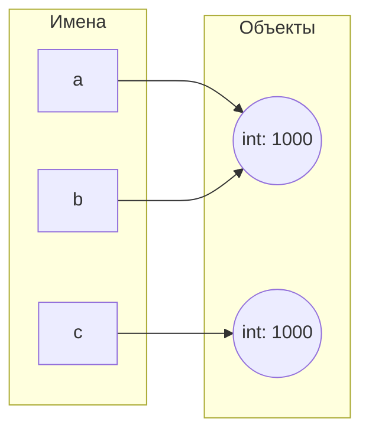

# Лабораторная работа № 1. Выполнение программы, объекты и базовые типы Python

## 1. Цель работы

Разобраться, как CPython выполняет программу, научиться отличать имя от объекта, корректно применять операции сравнения и работать с базовыми типами данных Python.

### Задание 1. От исходного кода к байткоду

#### Часть 1. Режимы запуска. 

Если в IDE/интерактивном интерпретаторе записать выражение:

```python
2 + 3 * 4
```

то в REPL результат появится автоматически, так как среде не нужен print() для вывода результата, в отличие от запуска файла. 
Изменим файл, чтобы при запуске выводился результат:

```python
print(2 + 3 * 4)
```

#### Часть 2. Выражения и инструкции.

Добавим в файл код:

```python
course = "Python"
hours = 4 * 2
print(f"{course}: {hours} часов")
```

-выражениями здесь являются `Python`, `4 * 2`, `f"{course}: {hours} часов")`

-все строки являются инструкциями (первые две это присваивание, последняя вызывает команду print)

-литералами являются `Python`, `4` и `2` 

-создаются имена `course` и `hours`

#### Часть 3. AST и байкод.

Выполнив в терминале команду:

```python
python --version
```
получаем версию интерпретатора: `Python 3.12.3`

---

Выполняем команду `python -m ast task_1.py` и находим:

 -Узел, соответствующий присваиванию `Assign()`
 
 -Узел, соответствующий арифметической операции `BinOp()` с оператором умножения `op=Mult()`


   ```python
 Assign(
         targets=[
            Name(id='hours', ctx=Store())],
         value=BinOp(
            left=Constant(value=4),
            op=Mult(),
            right=Constant(value=2)))
```

 
 -Узел, соответствующий вызову print() `Call()`, где в качестве функции `func` передается `Name(id='print', ctx=Load())`


   ```python
 Expr(
         value=Call(
            func=Name(id='print', ctx=Load()),
            args=[
               JoinedStr(
                  values=[
                     FormattedValue(
                        value=Name(id='course', ctx=Load()),
                        conversion=-1),
                     Constant(value=': '),
                     FormattedValue(
                        value=Name(id='hours', ctx=Load()),
                        conversion=-1),
                     Constant(value=' часов')])],
            keywords=[]))],
   type_ignores=[])
```

---

 Выполняем команду `python -m dis task_1.py` и находим:
 
  -Инструкцию, отвечающую за загрузку константы `LOAD_CONST`
  
  -Инструкцию, отвечающую за вызов функции `CALL`

```python
 4 LOAD_NAME                0 (print)
 6 LOAD_CONST               0 (14)
 8 CALL                     1
```

***Контрольный вопрос***

Байткод CPython выполняется на любой ОС при наличии подходящей виртуальной машины. Машинный код привязан к конкретной архитектуре и ОС (программа на процессоре Intel не запустится с процессором ARM).
Отсюда ответ: байткод предназначен для выполнения виртуальной машиной CPython, а не железом компьютера.

### Задание 2. Имена, объекты и сравнение.

```python
a = 1000
b = a
c = int("1000")

print("a == b:", a == b)

Ожидаемый результат: True
Полученный результат: True

print("a is b:", a is b)

Ожидаемый результат: True
Полученный результат: True

print("a == c:", a == c)

Ожидаемый результат: True
Полученный результат: True

print("a is c:", a is c)

Ожидаемый результат: False
Полученный результат: False
```



a и b ссылаются на один объект в памяти, а c - на другой

---

- Равенство значений `==` проверяет, что объекты идентичны по значению
- Идентичность объектов `is` проверяет, что разные переменные ссылаются на один и тот же объект в памяти

---

Меняем значение `с` на `None` и добавляем корректную проверку:

```python
c = None
print('c == None:', c == None)
print('c is None:', c is None)
```
В выводе получим `True` для обоих проверок

---

Выполняем отдельно следующий фрагмент:

```python
first = "python"
second = "py" + "thon"

print(first == second)
print(first is second)
```

В выводе так же получаем `True` для обоих проверок: 

-При использовании равенства `==` проверили, что объекты одинаковы, код вывел True

-Во втором же случае при использовании идентичности `is` код вывел True так как CPython оптимизирует память: чтобы не использовать больше памяти при сохранении одинаковых объектов, CPython объединяет объекты, поэтому переменные ссылаются на одну и ту же ячейку в памяти

---

Сформулируем правило:

 - Если нужно проверить равенство значений переменных, используем равенство `==`
 - Если нужно проверить, что переменные ссылаются на один и тот же объект, используем идентичность `is`

***Контрольные вопросы***

1. Инструкция `b = a` **не** создает копию объекта, а делает так, чтобы переменные ссылались на один и тот же объект в памяти
2. `type()` возвращает тип данных объекта, `id()` возвращает уникальный индентификатор объекта, который соответствует адресу этого объекта в памяти
3. `None` в Python существует в единственном экземпляре, и какая бы переменная ни принимала значение `None`, она всегда будет ссылаться на один и тот же объект в памяти, к тому же оператор `is` работает быстрее, чем `==`, так как сравнивает два адреса, а не объекты (не нужно заглядывать внутрь переменной)

### Задание 3. Числовые типы, операции и преобразования
